# Figma界面认识

## 一、界面滚动和缩放

+ 上下滚动： 使用鼠标滚轮
+ 左右滚动：Shift + 鼠标滚轮

+ 自由滚动：按住鼠标中键 ，然后进行拖动鼠标

+ 界面放大缩小：Crtl + 鼠标滚轮

+ 回到100%显示： Ctrl + 0

  

---

## 二、File

### 2.1 Save local copy

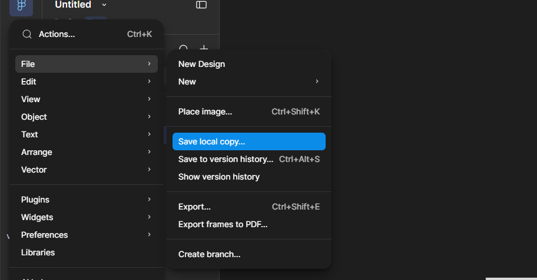

作用：保存到本地：xxx.fig格式

### 2.2 Save to version history

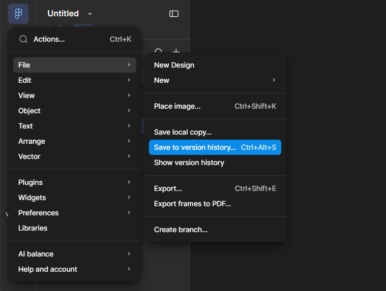

作用：主动保存一个版本历史

### 2.3 Show version history

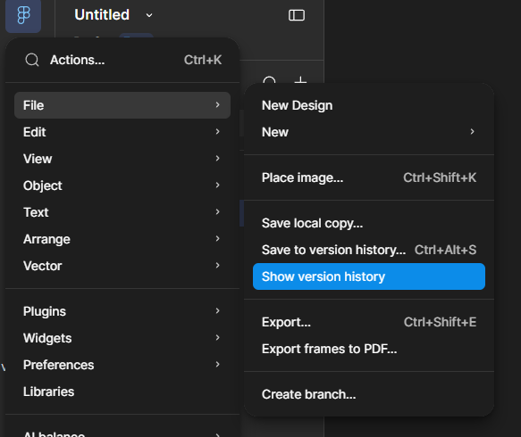

作用： 展示版本历史

---

## 三、Edit

### 3.1 Undo

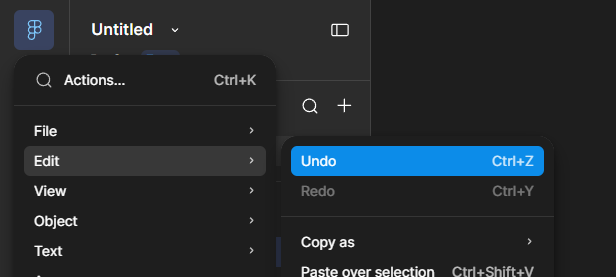

作用：撤销上一次操作

快捷键：Ctrl + z

### 3.2 Redo 

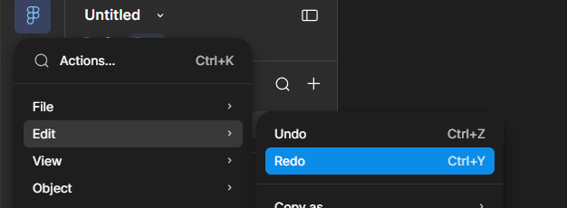

作用：将上一次的撤销操作恢复

快捷键：Ctrl + y

### 3.3 Copy as png

作用：复制为png图片，可以Ctrl + v进行粘贴

快捷键： Ctrl + Shift + C

---

## 四、View

### 4.1 Pixel grid

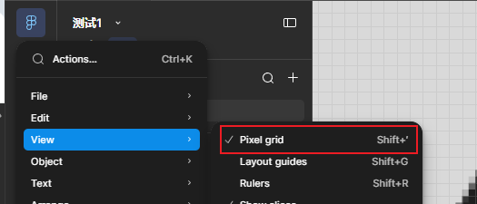

作用：显示或隐藏像素网格

快捷键：Shift + 单引号

### 4.2 Rulers

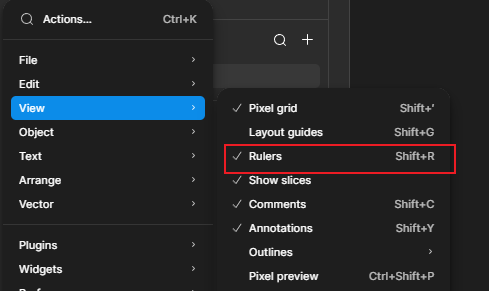

作用：显示或隐藏标尺和参考线。 显示的时候可以在左侧或上方的标尺 拖出参考线

快捷键： Shift + R

### 4.3 Pixel preview

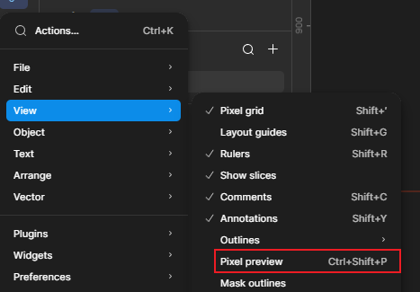

Figma 的 **Pixel Preview（像素预览）**，主要是用来查看设计在真实屏幕像素下会不会出现**模糊、半像素、边缘不清晰**的问题。

普通编辑模式下，Figma 使用矢量方式渲染，所以你把图形放在 `x=10.5px`、宽度设成 `100.5px`，看起来可能依然很平滑。但实际导出 PNG，或者最终显示到屏幕上时，某些边缘可能落在两个物理像素之间，于是就会出现发虚。

快捷键： Ctrl + Shift + P

### 4.4 Minimize UI

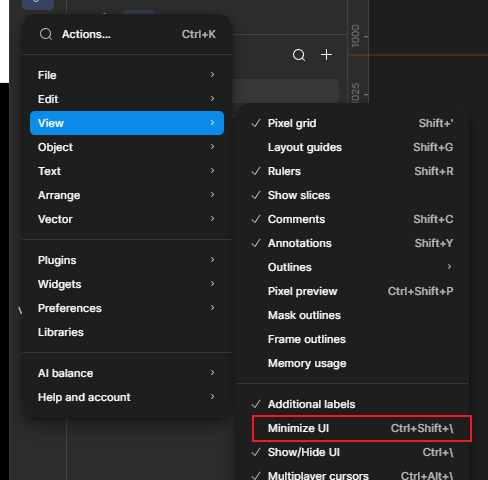

作用：最小化UI菜单

快捷键： Ctrl + Shift + \

### 4.5 Show/Hide UI

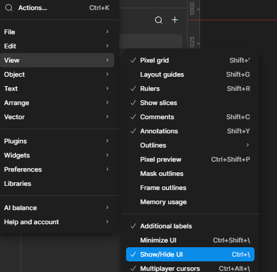

作用：显示或隐藏UI

快捷键：Ctrl + \

---

## 五、Arrange

### 5.1 Round to pixel

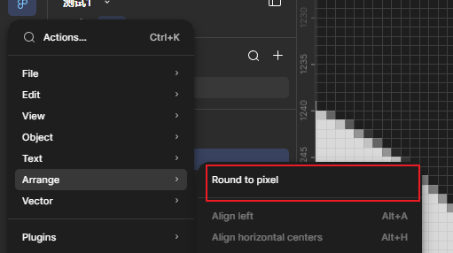

**Round to pixel 主要处理的是图层的 Position（X / Y）**，也就是让图层的位置落到整数像素坐标上

## 六、Preferences

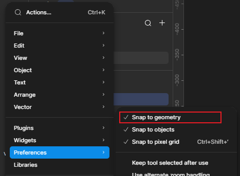

### 6.1 Snap to geometry

作用：对齐到几何，对齐吸附效果

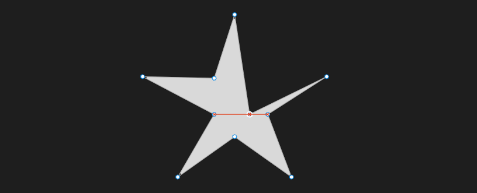

### 6.2 Snap to objects

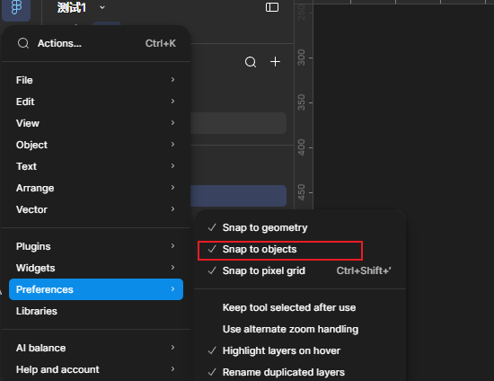

作用: 对齐到对象，对齐吸附效果

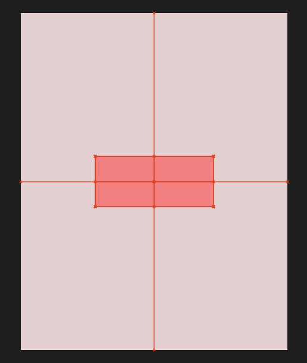

### 6.3 Snap to pixel grid

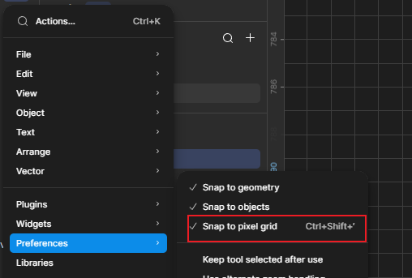

作用：对齐到像素网格， 拖动和绘制的时候都会对齐到像素网格

> [!TIP]
>
> 建议这三项都保持开启：
>
> + Snap to geometry
> + Snap to objects
> + Snap to pixel grid

### 6.4 Highlight layers on hover

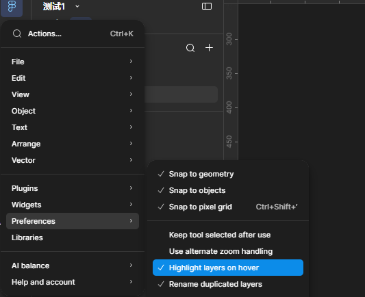

作用： 当鼠标进入图层(hover)的时候，高亮边框 ， 建议开启

### 6.5 Rename duplicated layers

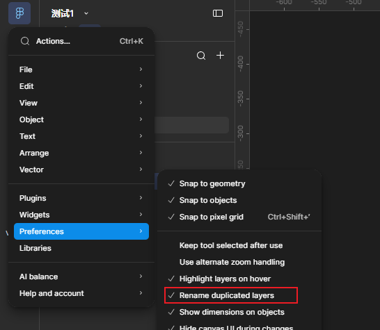

作用：重命名复制的图层，建议开启

补充知识： 快捷复制+粘贴： Ctrl + D

### 6.6 Show dememsions on objects

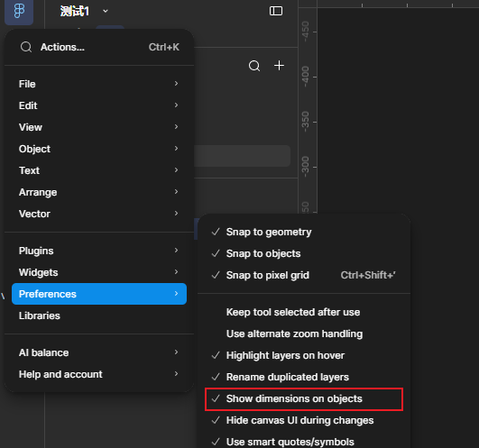

作用：显示对象的纬度尺寸，建议开启

### 6.7 Use number keys for opacity

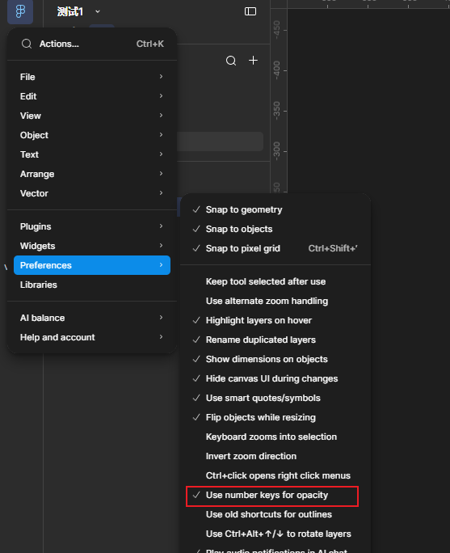

作用：使用数字键来控制透明度

### 6.8 Color profile settings

Figma 的 **Color profile settings** 一般就是这两个：

- **sRGB**
- **Display P3**

它们决定的是：**Figma 用什么色彩空间来解释和显示你设计里的颜色**。

**sRGB：**

这是目前 Web、Windows、Android、绝大多数普通显示器和网页内容最通用的色彩空间。

特点是：

- 兼容性最好
- 浏览器/Web 前端最稳
- 不同设备之间色差相对更可控
- 色域比 Display P3 小一些
- 很多 CSS 里的 `#FF0000`、`rgb()` 等，传统上基本都围绕 sRGB 使用

所以如果你是在做：

**网站、H5、后台管理、普通 App UI、给 Codex 还原前端**

我建议你直接使用 **sRGB**。

**Display P3：**

Display P3 是一种**更广色域**的色彩空间，可以表现比 sRGB 更鲜艳、更丰富的颜色，尤其是红色、绿色这一类高饱和度颜色。

苹果设备对 P3 的支持非常好，比如：

- iPhone
- iPad
- MacBook
- iMac

所以同样看起来是一个鲜艳的红色，在 P3 里可能比 sRGB 能显示得更“艳”。

但是问题也很明显：

> 你在 P3 显示器上设计得特别漂亮，不代表用户的普通 Windows 显示器或其他设备能看到完全一样的效果。

一些超出 sRGB 色域的颜色，在不支持 P3 的设备或某些处理流程里可能会被压缩或发生变化。

**怎么选：**

可以简单记成：

| 使用场景                     | 推荐              |
| ---------------------------- | ----------------- |
| Web 网站                     | ✅ sRGB            |
| H5                           | ✅ sRGB            |
| Vue / React 前端             | ✅ sRGB            |
| Android + iOS 通用 App       | ✅ sRGB            |
| 普通 UI 设计                 | ✅ sRGB            |
| 专门做苹果生态 App           | 可考虑 Display P3 |
| 摄影 / 高端视觉 / 广色域设计 | 可考虑 Display P3 |

### 6.9 Nudge amount

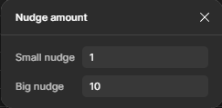

作用：控制微调尺寸和位置的小值和大值，按上图为例：

+ 键盘上下左右： 向上下左右移动1个像素网格
+ Shift + 键盘上下左右： 向上下左右移动10个像素网格

+ Ctrl + 键盘上下左右：尺寸变大或变小1个像素网格
+ Ctrl + Shift + 键盘上下左右： 尺寸变大或变小10个像素网格

> [!NOTE]
>
> 简记：
>
> + 只按方向键： 控制位置移动
> + Ctrl+方向键： 控制尺寸变化
> + 按大值来变化：就按住Shift

