# 形状属性参数

## 一、Alignment对齐设置

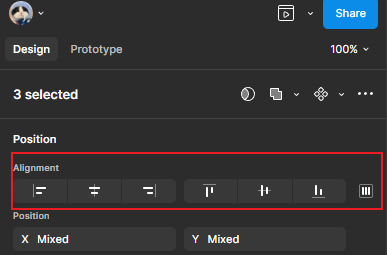

> [!NOTE]
>
> 对齐属性设置：
>
> + 需要至少选中2个图层才可以操作
> + 最后一个按钮more actions: 至少需要选择3个图层才可以操作

### 1.1 左对齐

设置位置：

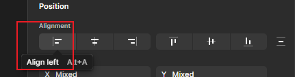

效果：

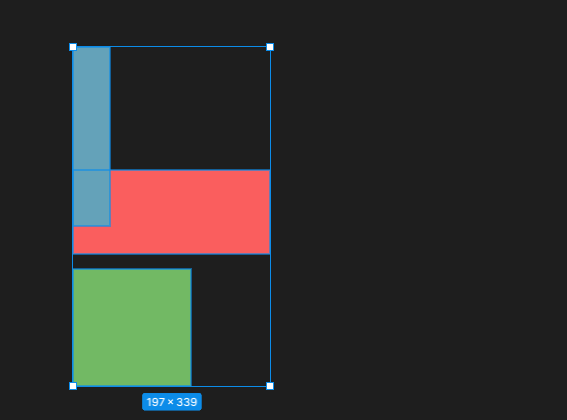

### 1.2 水平居中对齐

设置位置：

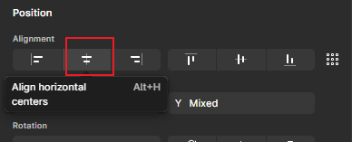

效果：

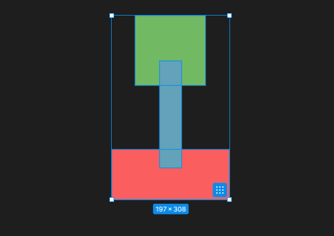

### 1.3 右对齐

设置位置：

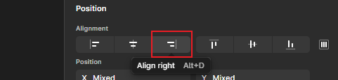

效果：

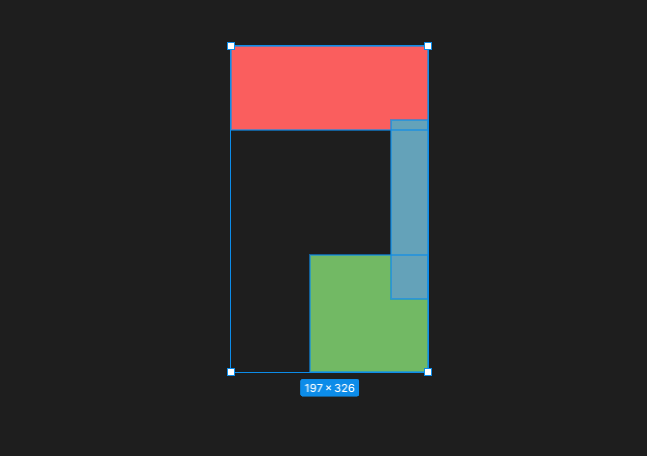

### 1.4 顶部对齐

设置位置：

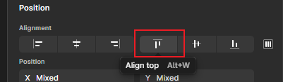

效果：

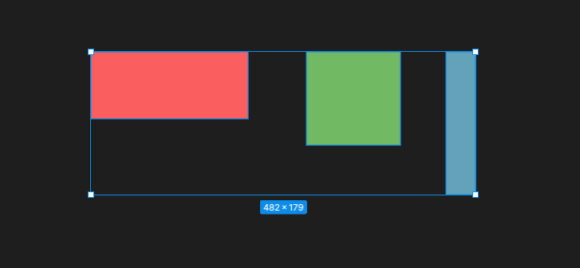

### 1.5 垂直居中对齐

设置位置：

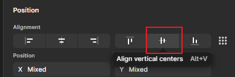

效果：

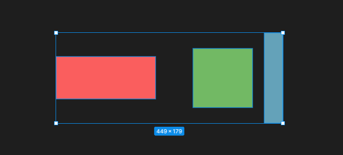

### 1.6 底部对齐：

设置位置：

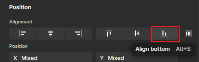

效果：

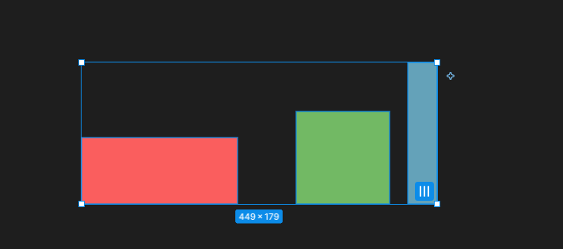

### 1.7 整理

设置位置：

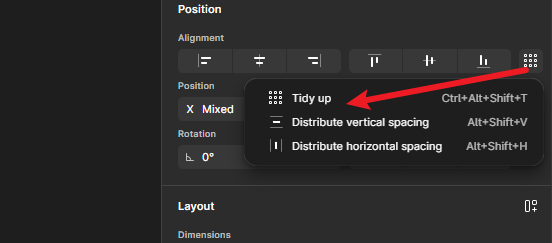

效果： 根据每个图层位置不同，整理后的效果可能不同

### 1.8 垂直平均分布

设置位置：

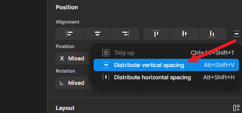

效果：

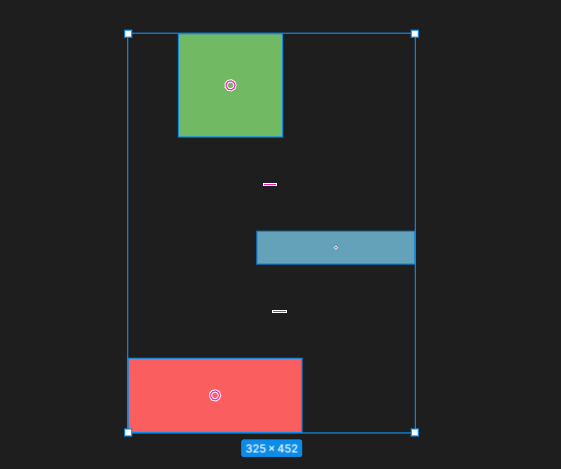

> [!IMPORTANT]
>
> 补充知识：
>
> 查看一个图层到另一个图层的间距：
>
> 先选中一个图层，然后移动按住`Alt`键，然后移动鼠标到另一个图层，就会显示两图层之间的间距

### 1.9 水平平均分布

设置位置：

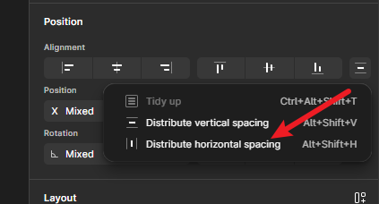

效果：

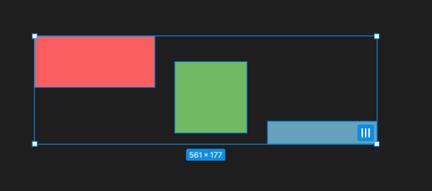