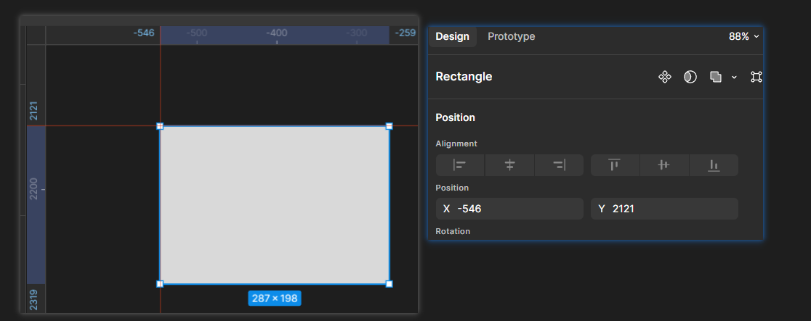
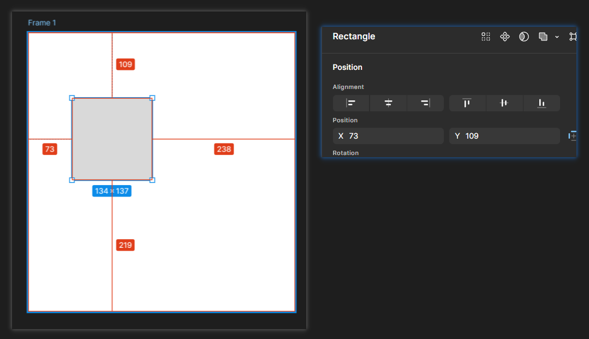
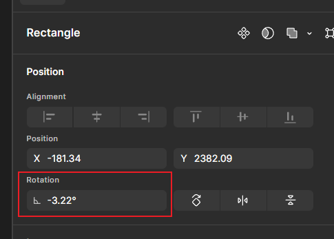
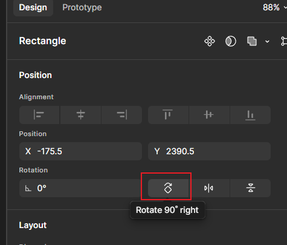
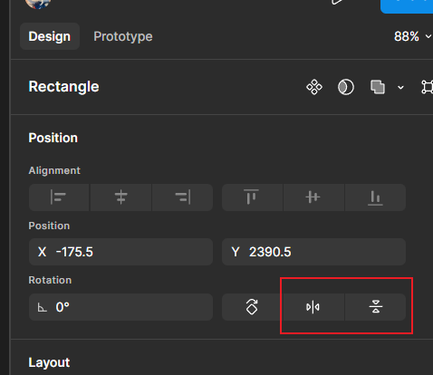
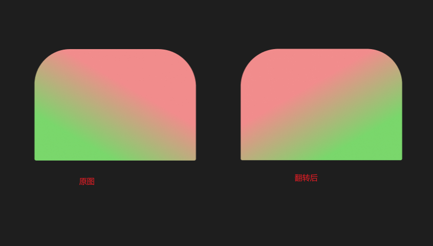
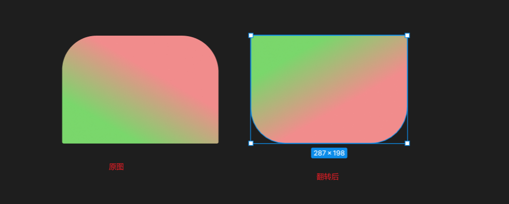

# 形状属性参数

## 一、Alignment对齐设置

> [!NOTE]
>
> 对齐属性设置：
>
> + 需要至少选中2个图层才可以操作
> + 最后一个按钮more actions: 至少需要选择3个图层才可以操作

### 1.1 左对齐

设置位置：

效果：

### 1.2 水平居中对齐

设置位置：

效果：

### 1.3 右对齐

设置位置：

效果：

### 1.4 顶部对齐

设置位置：

效果：

### 1.5 垂直居中对齐

设置位置：

效果：

### 1.6 底部对齐：

设置位置：

效果：

### 1.7 整理

设置位置：

效果： 根据每个图层位置不同，整理后的效果可能不同

### 1.8 垂直平均分布

设置位置：

效果：

> [!IMPORTANT]
>
> 补充知识：
>
> 查看一个图层到另一个图层的间距：
>
> 先选中一个图层，然后移动按住`Alt`键，然后移动鼠标到另一个图层，就会显示两图层之间的间距

### 1.9 水平平均分布

设置位置：

效果：

## 二、Position

### 2.1 x和y

> [!IMPORTANT]
>
> x和y：是相对于父容器的相对位置

情况1 ： 元素直接在画布中：

情况2： 元素在一个容器中：

### 2.2 Rotation 旋转

旋转方法：

+ 方法1：鼠标移动到元素外的四个角，光标变成弧线形状的双向箭头， 然后拖动鼠标
+ 方法2：直接修改Rotation数值
+ 方法3：鼠标进入Rotation输入框，按下鼠标中键，然后左右拖动鼠标

### 2.3 Rotation 90° right

作用： 点击一次就顺时针旋转90°

### 2.4 Flip horizontal 和 Flip vertical

作用： 水平翻转或垂直翻转。

水平翻转示例：

垂直翻转示例：

