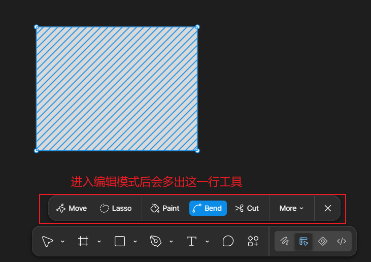
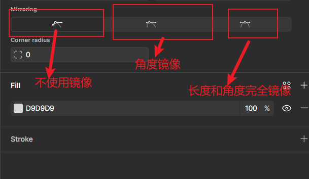
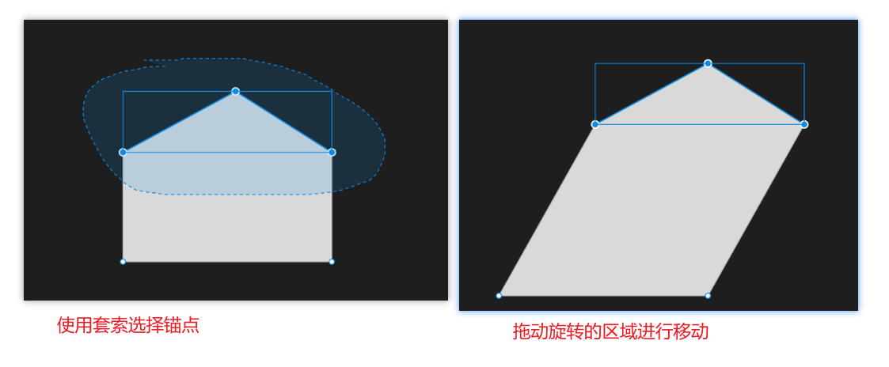
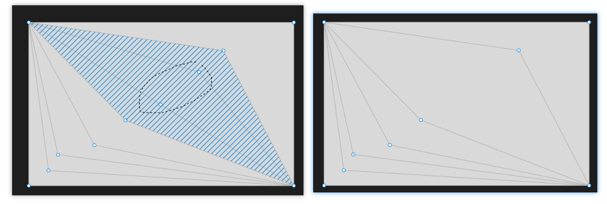
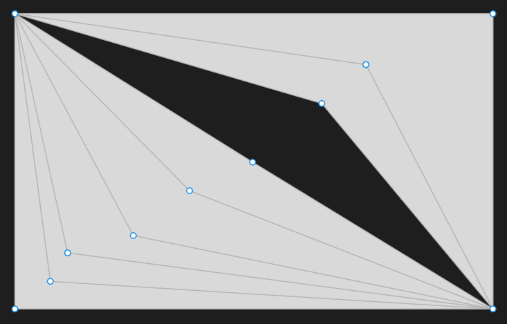
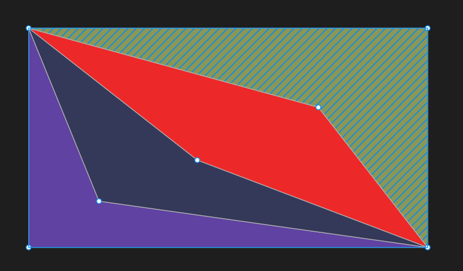
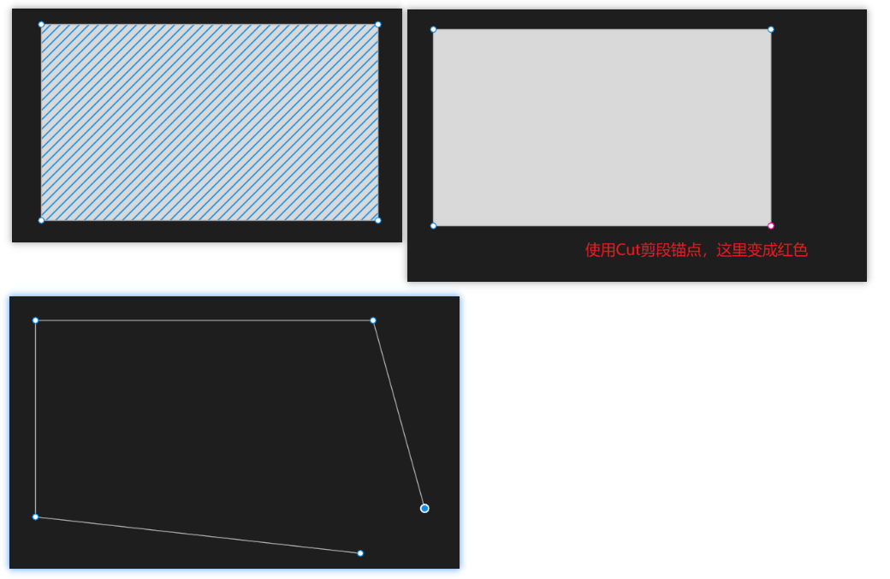
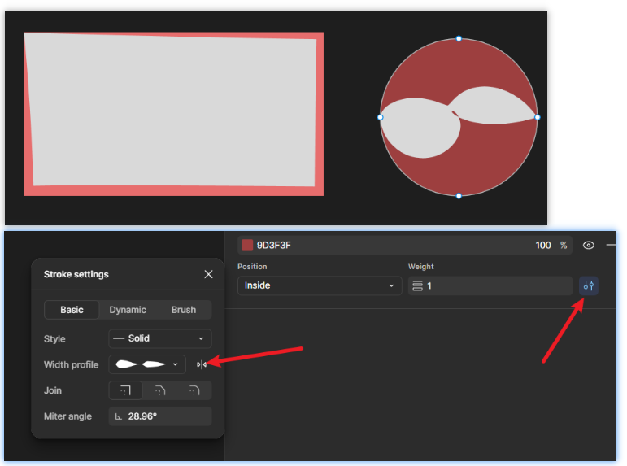

# 形状编辑和钢笔工具

## 一、形状编辑

### 1.1 进入和退出编辑模式

+ 进入编辑模式 ：双击图层区域

+ 退出编辑模式：
  + 方式一：双击图层内部或外部
  + 方式二：在图层内部按Enter

---

### 1.2 Move 移动工具

+ 可以拖动锚点或边，进行移动
+ 按照Shift再移动：按照点或边初始位置的15度角倍数进行移动

+ 删除锚点：
  + Delete键或 Back键
  + 如果希望删除后保留闭合：Shift + Delete键或 Back键

---

直线和曲线的锚点：

+ 直线中间可以添加锚点
+ 曲线中间不能添加锚点

---

### 1.3 Bend 弯曲工具

+ 进入弯曲工具：
  + 按下Ctrl 并拖动锚点： 当前移动使用弯曲工具
  + 手动选择到Bend工具：选择弯曲工具，然后再进行移动

+ Mirroring 镜像设置

> [!NOTE]
>
> 注意：在使用镜像设置的时候，不要使用Bend模式，无效果。
>
> 推荐步骤：
>
> 1. 先选择Move工具上
> 2. 设置镜像模式
> 3. 拖动手柄进行操作 （拖动手柄的时候不需要再按Ctrl键了，不然会变成完全镜像的模式 ）

### 1.4 lasso 套索工具

作用：选择锚点

### 1.5 Shape builder 

> [!NOTE]
>
> 补充知识：
>
> + 快捷复制： 鼠标Hover进图层， 按住Alt然后鼠标拖动， 即可快速复制出一个图层来.
> + 编辑模式下：鼠标移动到锚点上，按住Alt然后鼠标拖动， 即可复制出一个锚点

Shape builder:

+ 快捷键：M

移除某一个区域：

+ 在Shape builder模式下，按下Alt键， 然后移动鼠标进行选择区域，选中的区域是红色，然后鼠标左键即可减去这个区域

### 1.6 Paint 油漆桶

作用： 为区域添加或移除填充色

### 1.7 Cut 剪断锚点

使用示例：

### 1.8 Variable width 可变化的宽度

---

## 二、钢笔工具

+ 快捷键：P
+ 绘制直线：鼠标左键按下的两点，自动构成直线
+ 绘制曲线：按下生成锚点后不要松鼠标，进行拖动，就可以构成曲线
+ 调整曲线：按下Ctrl , 然后鼠标拖动

+ 可以使用钢笔工具删除锚点：
  + 编辑模式下选择钢笔工具，然后按住Alt键，鼠标移动到锚点上，光标变成一个钢笔和减号，就可以删除锚点
  + 使用钢笔工具删除锚点，删除后默认形状还是闭合的，效果类似于：Shift+Del 删除

