# 组/画框/蒙版

## 一、组

### 1.1 创建组和解除组

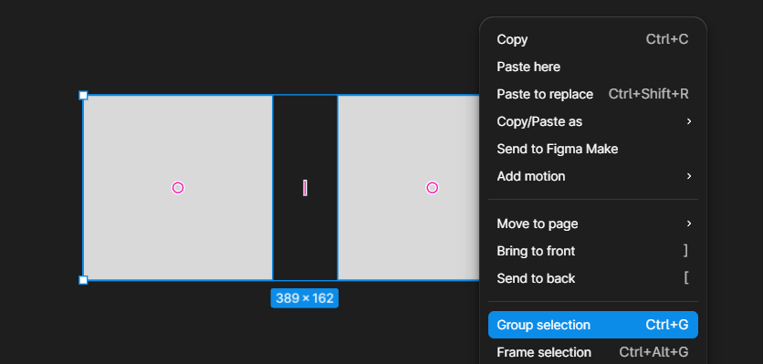

创建组快捷键：Ctrl + G

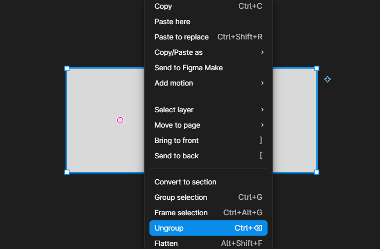

解除组快捷键：Ctrl + Back

---

### 1.2 调整组内顺序和间距

#### 情况1：组内只有两个图层

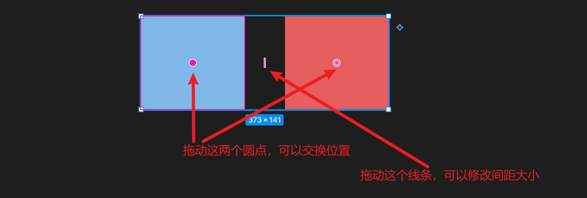

#### 情况1：组内有超过2个图层

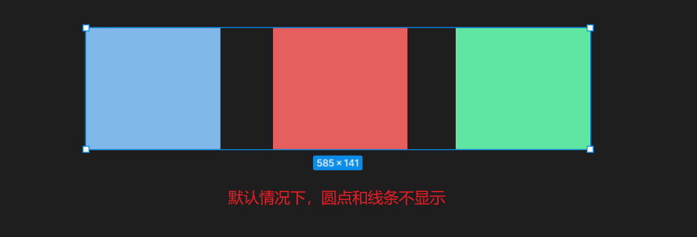

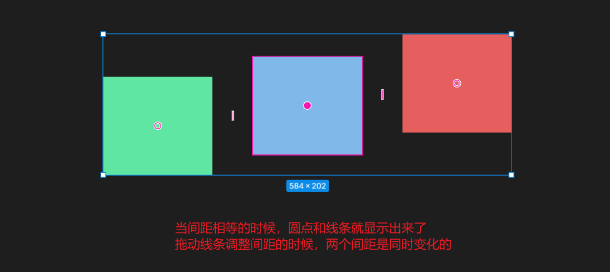

### 1.3 透明度和圆角半径

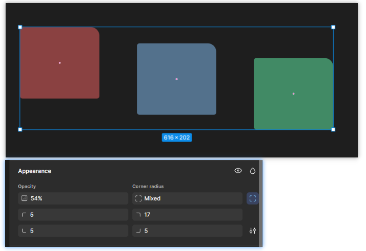

透明度：设置的是组内所有图层的透明度

圆角：设置的也是组内所有图层的圆角

---

## 二、Frame 画框

### 2.1 创建画框

#### 情况1：直接创建画框

快捷键：F

#### 情况2：将已有图层放进画框

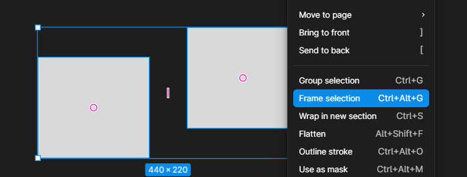

快捷键：Ctrl + Alt + G

### 2.2 组和画框的区别

**区别1：缩放**

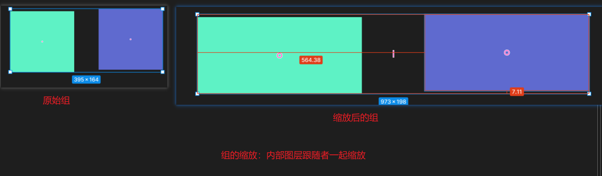

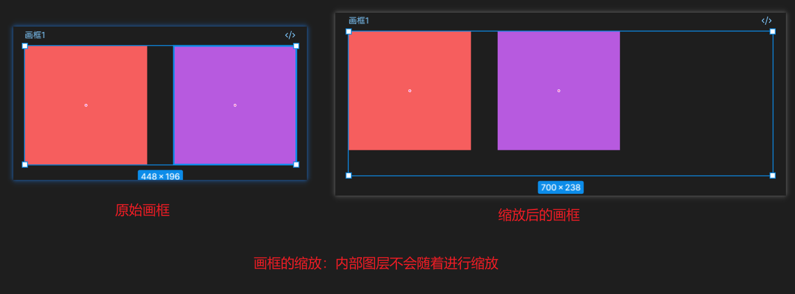

**区别2：改变内部元素的位置或大小**

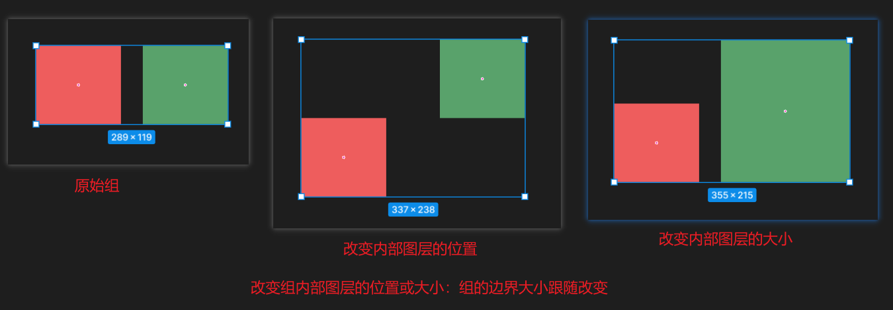

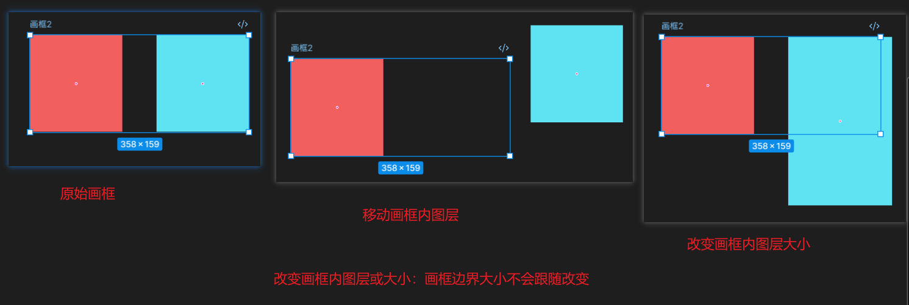

**区别3：移动外部图层经过组或画框的时候**

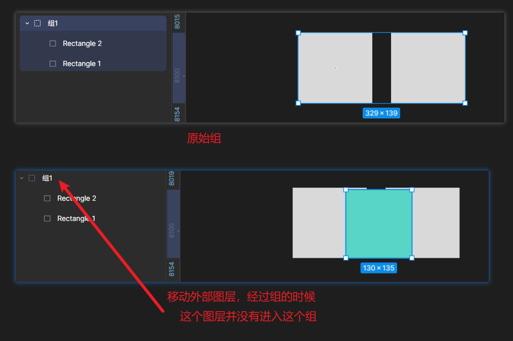

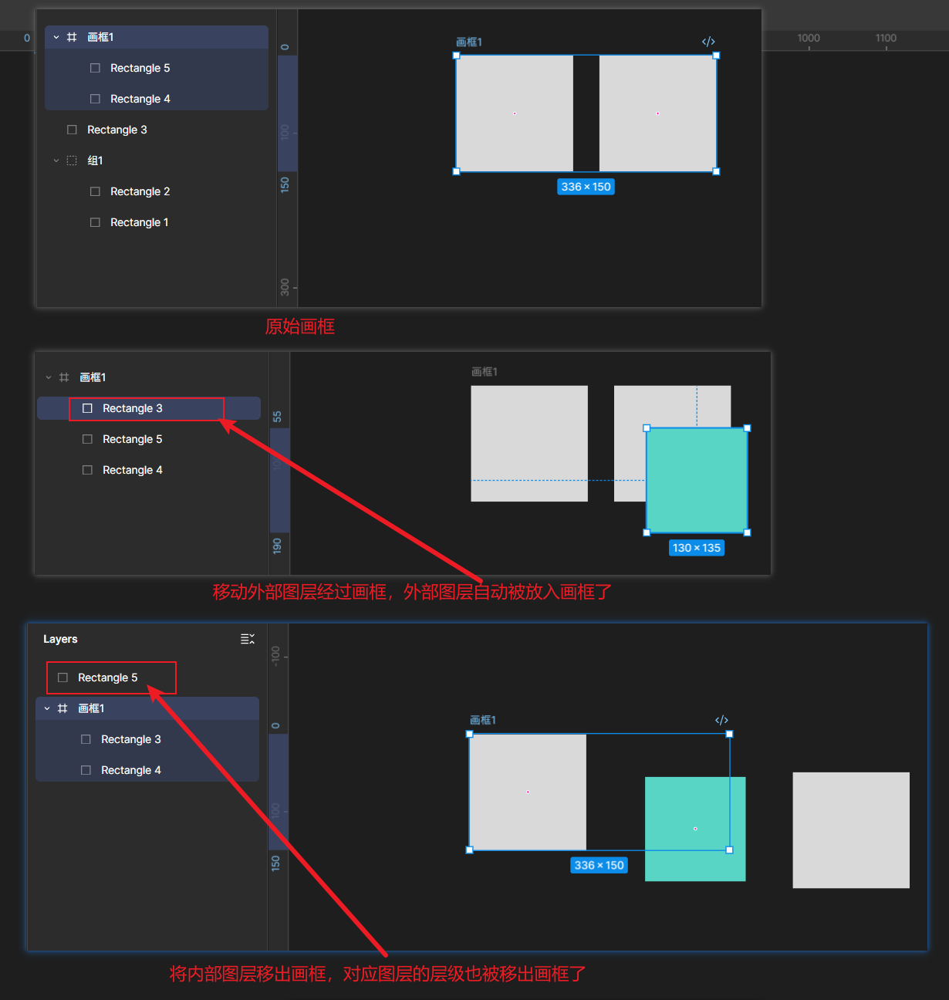

> [!NOTE]
>
> **技巧：**
>
> 如果希望移动外部图层经过画框的时候，不要自动放入画框，移动的过程按住空格键即可！

---

### 2.3 画框属性设置

