# 线性图标绘制

## 一、绘制Keyline

第1步：创建一个24*24的画框

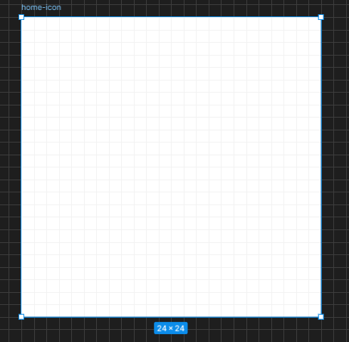

第2步：绘制对角线

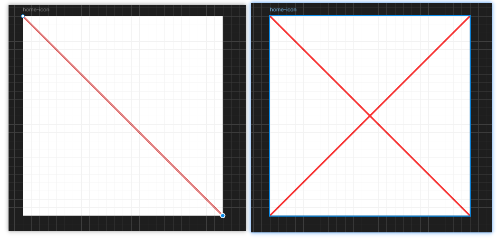

+ P：钢笔工具，绘制一条对角线
+ V：取消钢笔工具
+ 选中刚才画的对角线：Ctrl+D 复制一条对角线
+ Shift+H：水平翻转这条对角线

第3步：绘制”米“字线

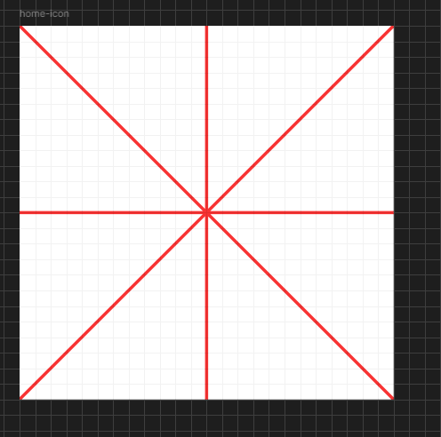

先画一条横线或竖线，然后复制，再旋转90度。

> [!NOTE]
>
> 水平线或垂直线，需要旋转90度，而不是水平或垂直翻转，因为水平或垂直翻转后依然是原样的一条线

第4步： 绘制一个圆

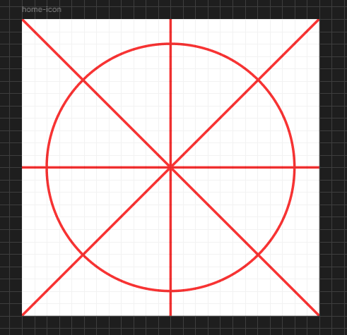

+ 先绘制一个圆
+ 选中任意一条线，复制属性
+ 选中圆，粘贴属性

第5步：创建两个矩形

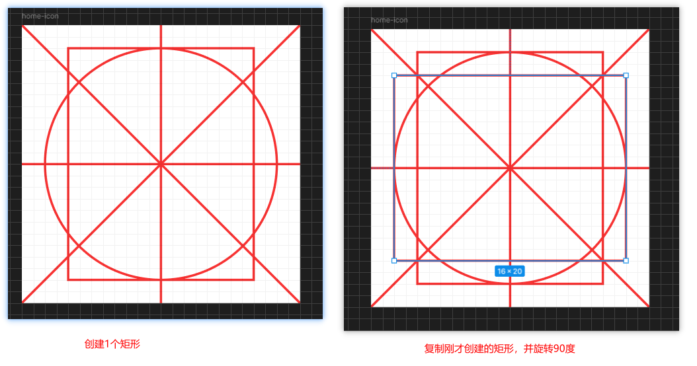

第6步：绘制一个正方形

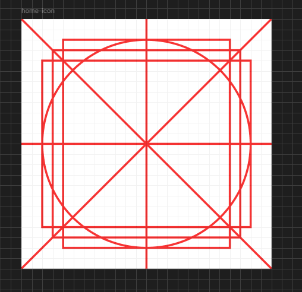

第7步：中间再绘制1个小圆

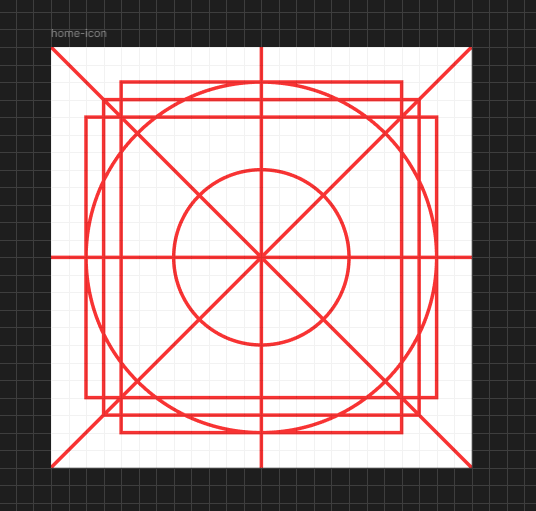

+ 选中上面创建的大圆，Ctrl + D 复制
+ 选中复制这个圆，按住Shift + Alt，然后拖动鼠标进行缩放

第8步：给三个矩形添加圆角半径

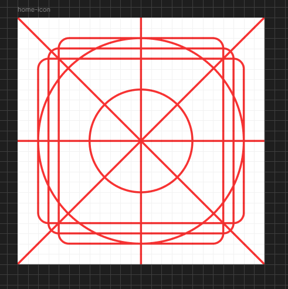

+ 选中三个矩形
+ 设置圆角半径：1

第9步：合并所有的辅助线图层

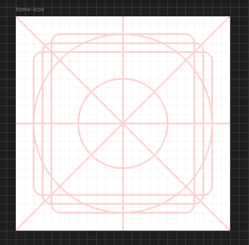

+ 选中所有的辅助线图层 -> 进行Union
+ 设置透明度：比如20%

至此，就绘制完成了一个Keyline

## 二、绘制小房子图标

第1步：如果担心后续编辑误操作到辅助线，可以先将辅助线图层锁定

第2步：绘制一个正方形，让该正方形卡在辅助线最中心的正方形上

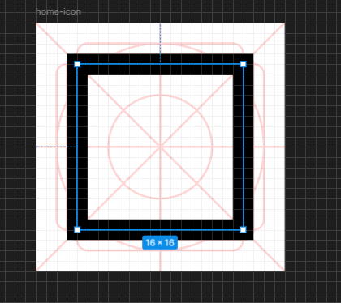

+ 绘制一个正方形，让该正方形卡在辅助线最中心的正方形上
+ 取消正方形填充色
+ 添加正方形描边：Center，宽度为2

第3步：制作房顶

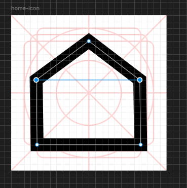

+ 进入编辑模式
+ 在矩形顶部横线的中心添加一个锚点
+ 按住Shift选择顶部左右两个锚点
+ 鼠标往下拖，脱出一个房顶的形状

第4步：删除描边，添加一个填充（方便后面做布尔运算进行查看）

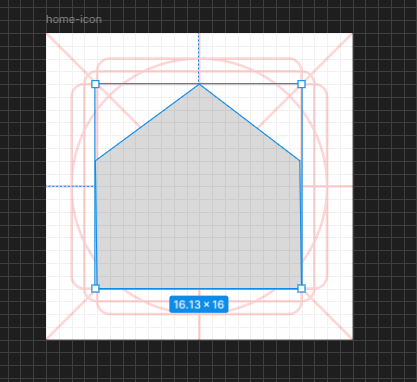

第5步：绘制底部小门

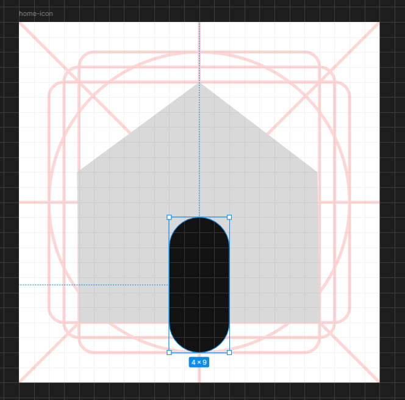

第6步：进行布尔运算：减去

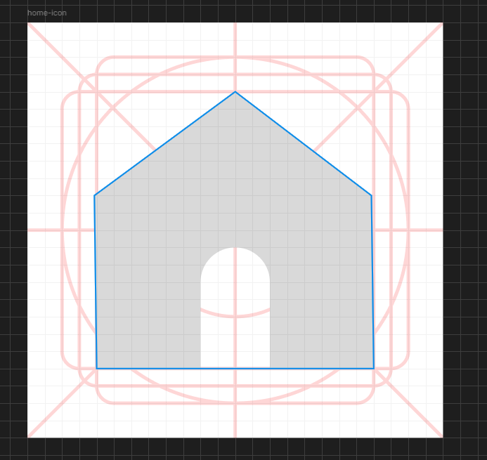

+ 选中小房子和小门：布尔运算->减去
+ 调整校门的圆角：4

第7步：对减去后图层，再进行描边：Center，宽度2

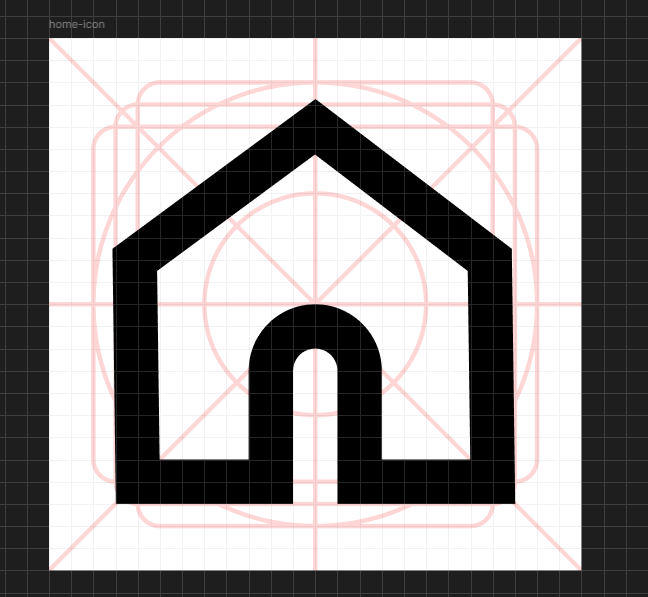

第8步：给小房子添加一个圆角：1

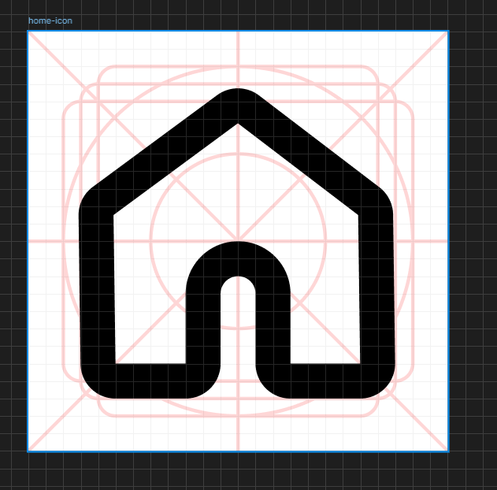

---

## 三、绘制放大镜图标

第1步：绘制1个圆

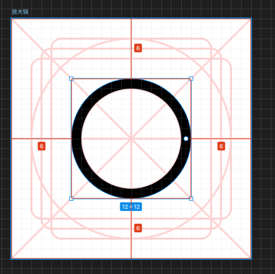

第2步：复制刚才小房子的属性，然后粘贴属性，然后调整位置和大小

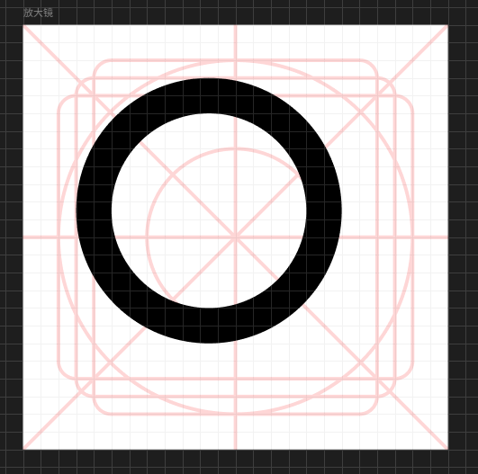

第3步：绘制手柄， 可以用矩形或描边去做，推荐用描边

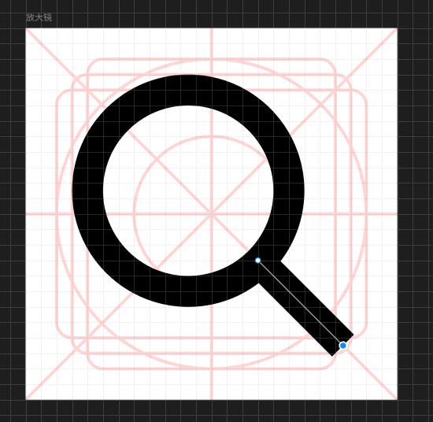

第4步：调整手柄的端点样式和尺寸

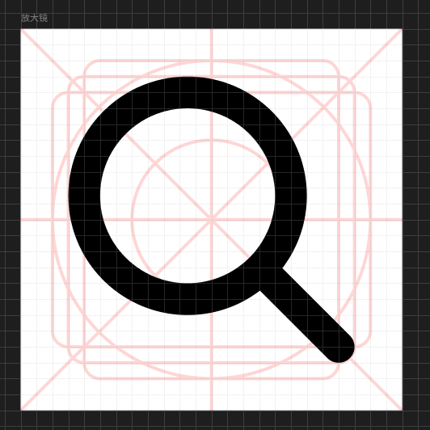

