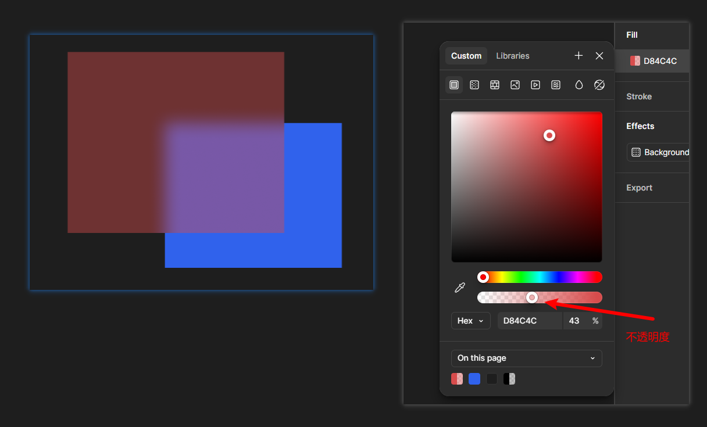
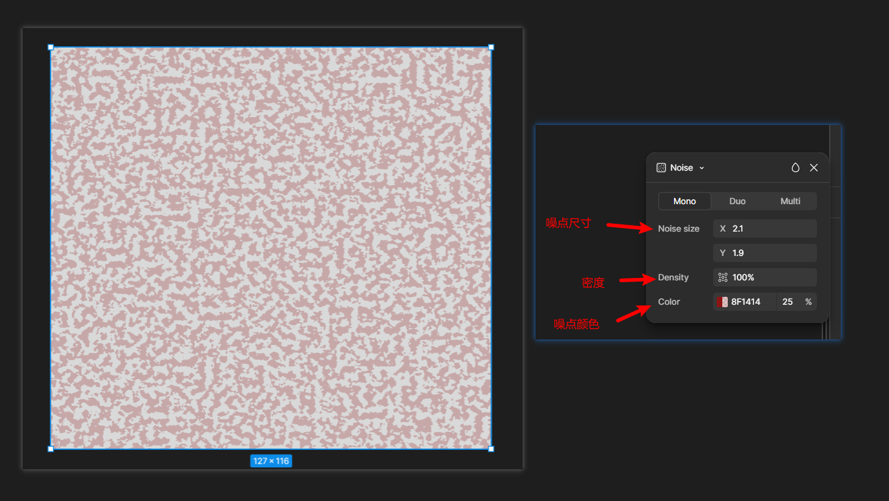
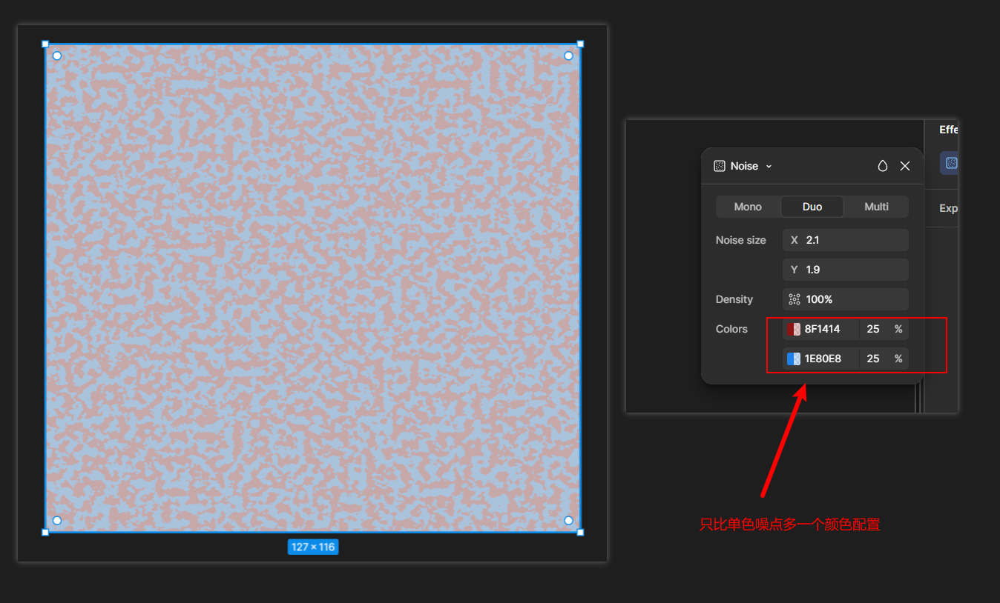
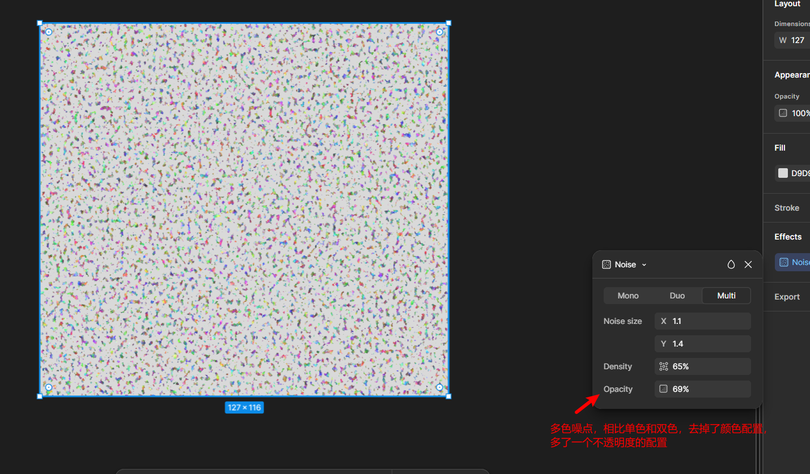
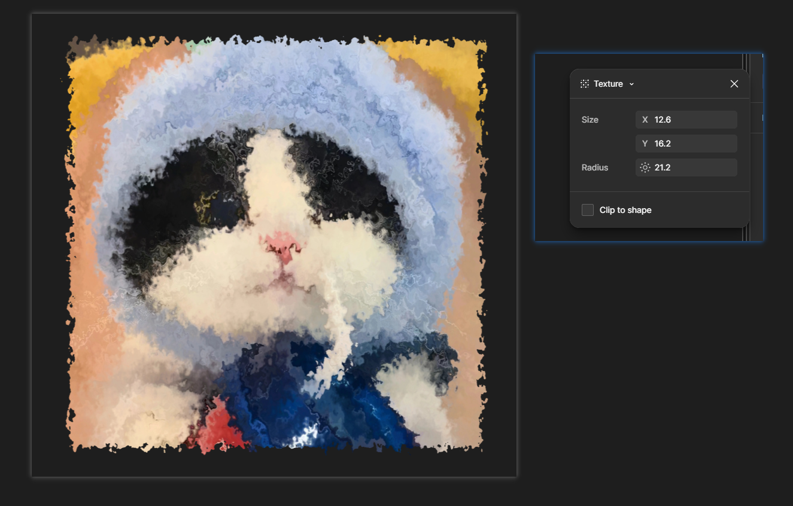

# 效果

## 一、Inner shadow 内阴影

### 1.1 内阴影基本效果

### 1.2 使用内阴影制作凹陷效果

---

## 二、Drop shadow 投影

### 2.1 投影基本效果

### 2.2 投影案例

---

## 三、Layer blur 图层模糊

### 3.1 Uniform 统一模糊

### 3.2 Progressive 渐进式模糊

### 3.3 图层模糊案例

第1步：使用钢笔工具绘制一个区域

第2步：对这个区域进行颜色填充

第3步：将这个形状放入画框并取消描边

第4步：按上面的方法，再绘制几个不规则的图形

第5步：对这些图层统一或者分别设置模糊，就得到了案例结果

---

## 四、Background blur 背景模糊

### 4.1 基本效果

> [!NOTE]
>
> 作用：设置背景区域（下面的图层）的模糊度
>
> 注意事项：
>
> + 需要给上面图层(设置背景模糊属性的图层) 设置透明度才能看见效果
> + 设置透明度**不能**通过Appearance -> Opacity 进行设置， 而是需要通过Fill填充色进行设置

---

## 五、Noise 噪点

### 5.1 Mono 单色噪点

### 5.2 Duo 双色噪点

### 5.3 Multi 多色噪点

---

## 六、Texture 纹理

### 6.1 纹理基本效果

> [!TIP]
>
> **Size = 横向尺寸**
>
> 决定每一个坑、凸起、颗粒大不大。
>
> **Radius = 纵向深度**
>
> 决定这些坑能向图形里面/外面延伸多深。
>
> 
>
> 另外还有一个非常重要的 **Clip to shape**：
>
> **开启**：纹理基本限制在原图形边界内。
>
> **关闭**：纹理可以越过原来的边界。

