# 效果

## 一、Inner shadow 内阴影

### 1.1 内阴影基本效果

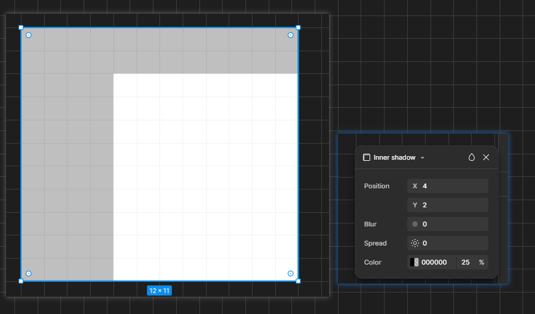

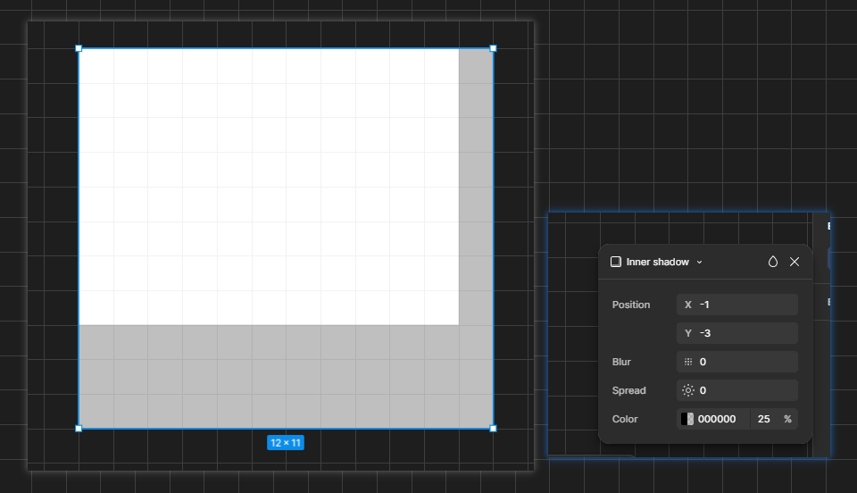

### 1.2 使用内阴影制作凹陷效果

---

## 二、Drop shadow 投影

### 2.1 投影基本效果

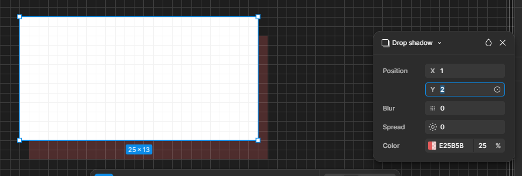

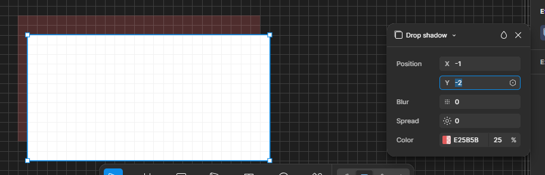

### 2.2 投影案例

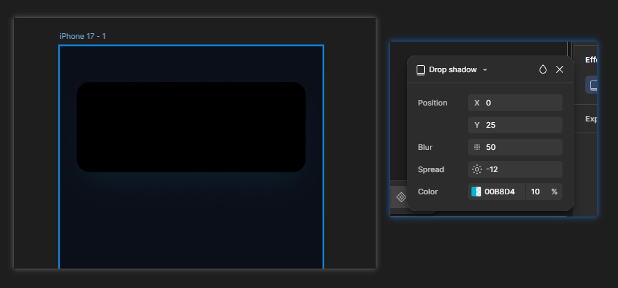

---

## 三、Layer blur 图层模糊

### 3.1 Uniform 统一模糊

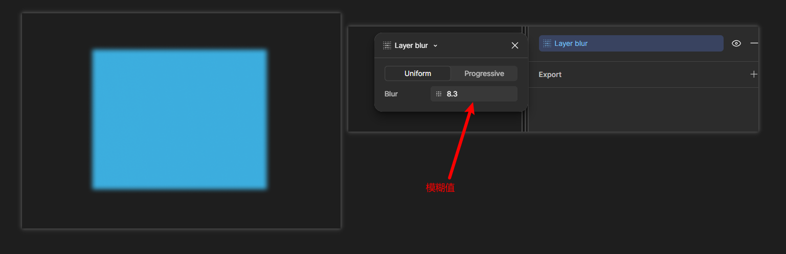

### 3.2 Progressive 渐进式模糊

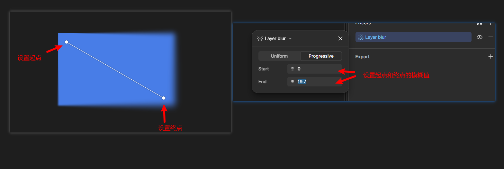

### 3.3 图层模糊案例1

第1步：使用钢笔工具绘制一个区域

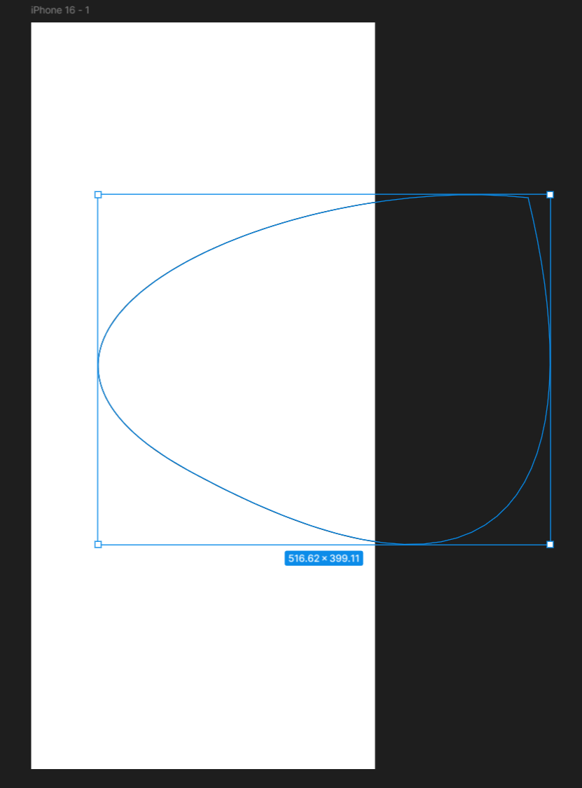

第2步：对这个区域进行颜色填充

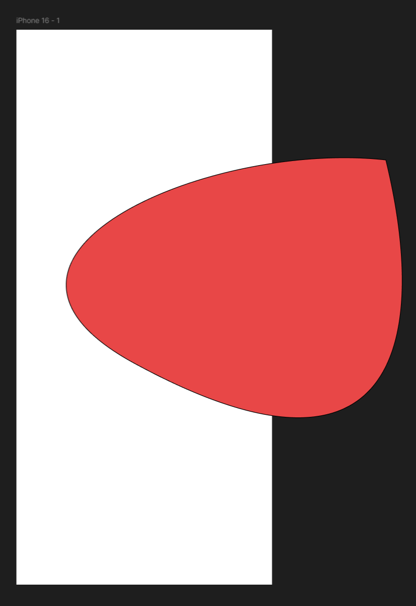

第3步：将这个形状放入画框并取消描边

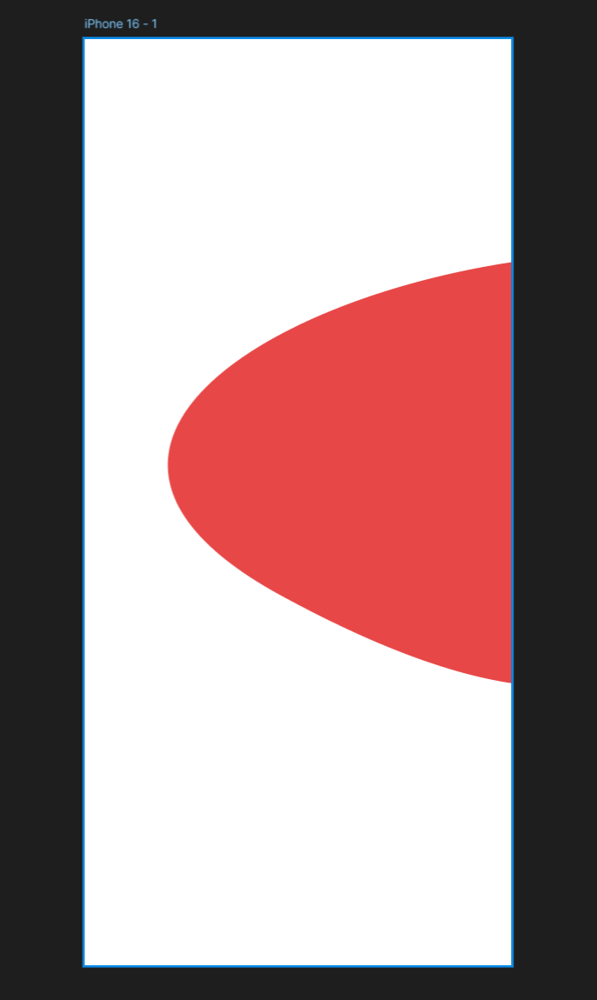

第4步：按上面的方法，再绘制几个不规则的图形

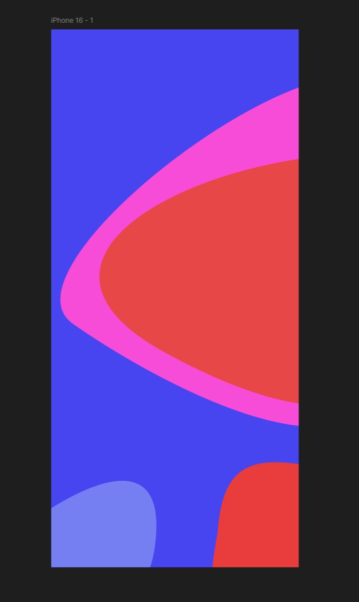

第5步：对这些图层统一或者分别设置模糊，就得到了案例结果

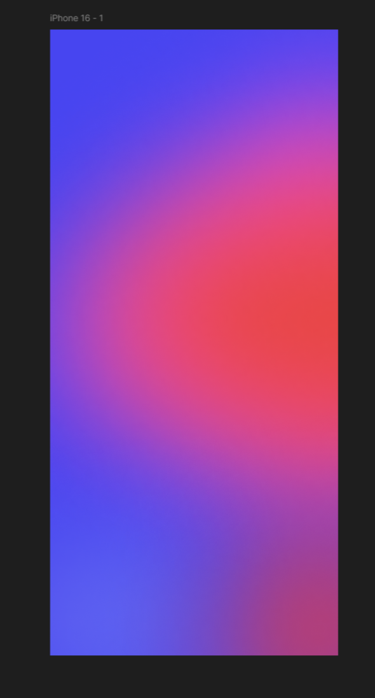
