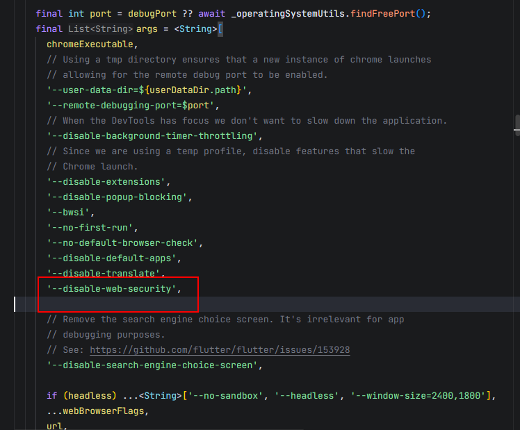

# 解决web跨域问题

第1步：在`flutter/packages/flutter_tools/lib/src/web/chrome.dart`在如下位置添加：

```
'--disable-web-security',
```



第2步：删除`flutter/bin/cache`目录下的：<span style="color:red">flutter_tools.snapshot </span>和 <span style="color:red">flutter_tools.stamp</span> 文件

第3步：执行`flutter doctor -v`， 然后重新运行项目