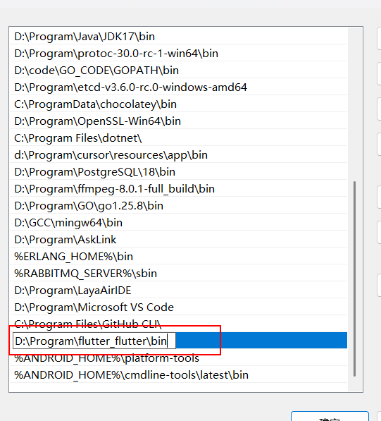
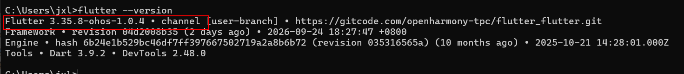
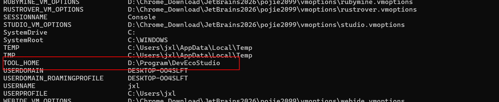
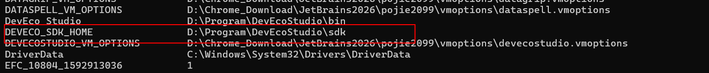
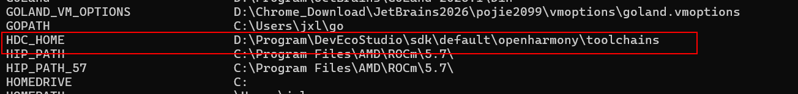
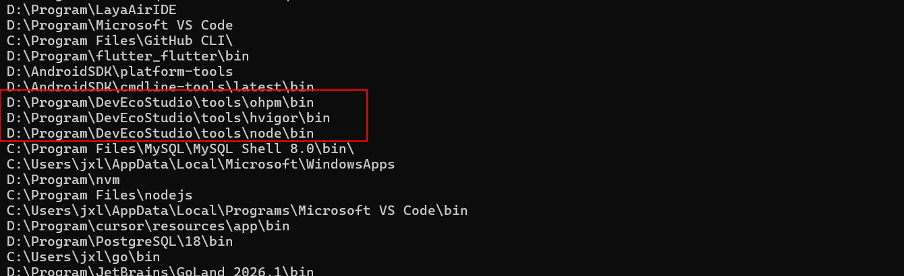
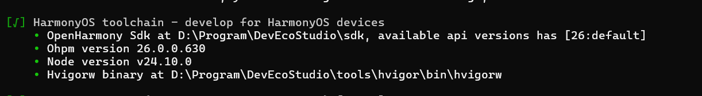

# 鸿蒙端

## 一、下载鸿蒙版flutter

```
git clone https://gitcode.com/openharmony-tpc/flutter_flutter.git
```

下载后配置环境变量PATH，将原来的flutter bin路径换成新的flutter bin路径，例如



然后检查环境

```
flutter --version
```




---

## 二、安装

下载地址：https://developer.huawei.com/consumer/cn/download/

## 三、配置鸿蒙环境变量

```
export TOOL_HOME=D:\Program\DevEcoStudio    # DevEcoStudio安装目录
export DEVECO_SDK_HOME=%TOOL_HOME%\sdk  # sdk目录
export HDC_HOME=%DEVECO_SDK_HOME%\default\openharmony\toolchains # hdc
export PATH=%TOOL_HOME%\tools\ohpm\bin:$PATH # ohpm
export PATH=%TOOL_HOME%\tools\hvigor\bin:$PATH # hvigor
export PATH=%TOOL_HOME%\tools\node\bin:$PATH # node
```


检查环境变量（windows powershell）：

```powershell
dir env:
```







```
检查PATH环境变量
$env:Path -split ';'
```



检查环境：

```
flutter doctor -v
```



## 四、运行flutter项目到鸿蒙端


