# Codex

> [!IMPORTANT]
>
> Code安装前置：
>
> + Git
> + NodeJs
> + VsCode

## 一、CC Switch安装

因为后面我们可能会有多种接入codex的方式

去改codex的配置文件会很麻烦

所以基本上都会下载 cc switch这个配置切换的软件

这个软件主要功能就是切换配置的

不过现在很全面了，支持 claude code，codex这些ai agent

还有一些非常好用的功能，这个后面我们再讲

录视频截至的时候，cc switch的最新版本是3.16.5

能访问github的，就直接去github上下载

如果要和视频里面操作一样，那就下载3.16.5这个版本

https://github.com/farion1231/cc-switch/releases/tag/v3.16.5

如果访问github慢，我把windows和macOS的cc switch3.16.5放到网盘里面了

https://pan.quark.cn/s/f1ba0b6a5954

就直接双击安装就好了，这个没什么好说的

---

---

## 二、登录和接入Codex

codex本身只是一个软件，一个客户端

真正让它干活需要给他配置模型

codex支持多种接入方式

### 2.1 deepseek接入codex

接入步骤：

第1步：在deepseek开放平台创建一个api key

第二步：CC Switch配置：

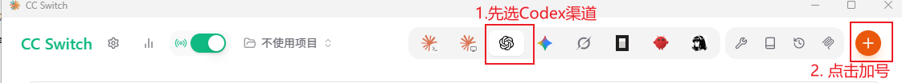

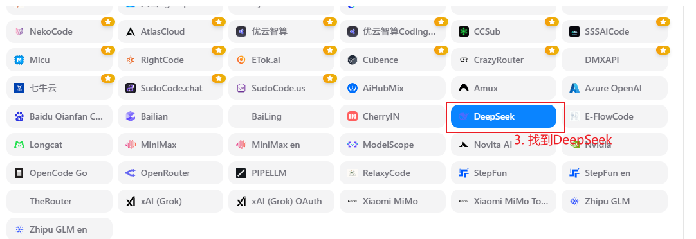

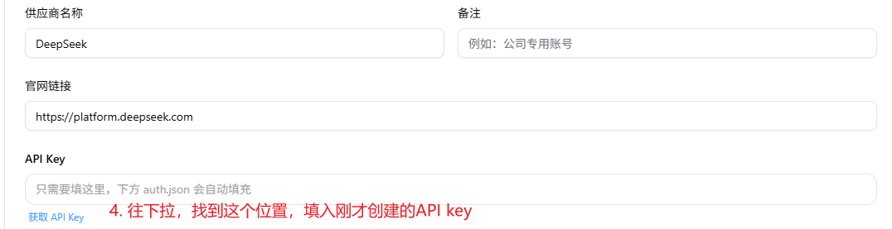

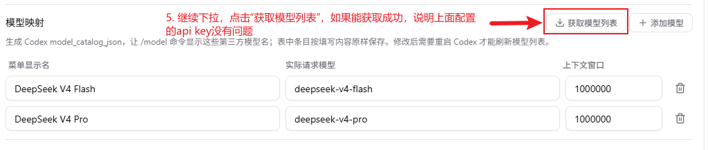

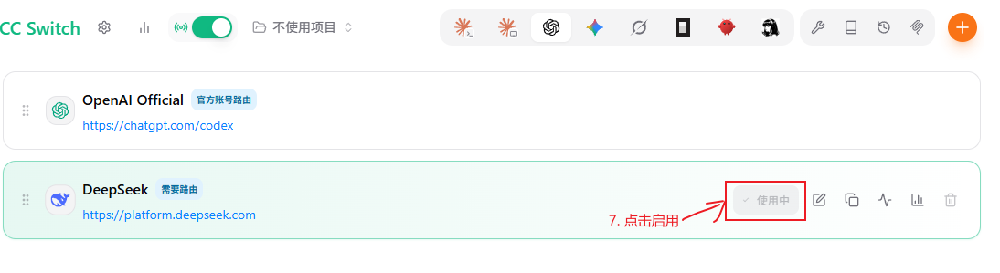

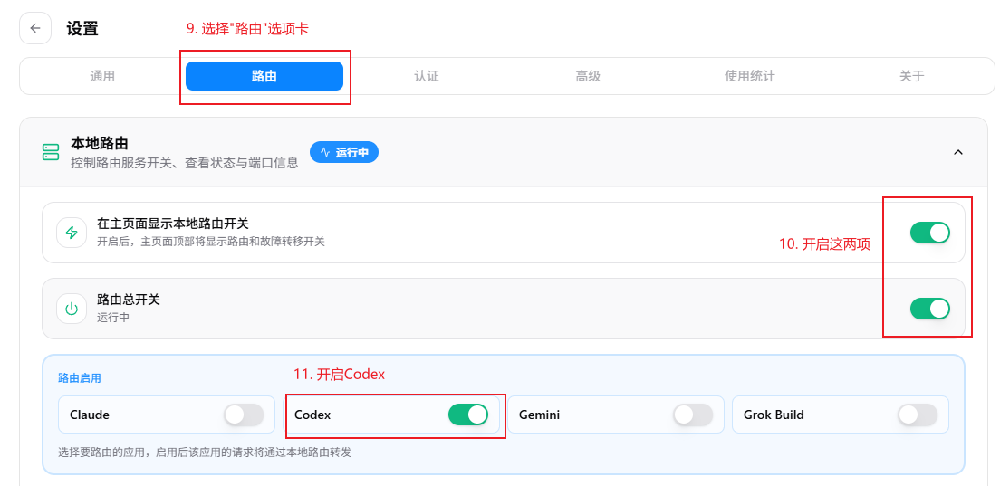

第三步： 重启Codex！！！ 进行测试

> [!NOTE]
>
> deepseek模型目前(20260723)还是不支持多模态，你在codex里面发图片是不行的，有些会报错，有些会识别不了

---

---

### 2.2 中转站接入

适合谁？？？

- 没有网络条件、没有gpt plus的用户
- 但是想用gpt模型的人
- 想按量付费的人
- 想把gpt5.6接到自己的项目的人

接入非常简单，我最近一直在用的中转站 apinebula

我博客的ai答疑、ffzd.ai的生图功能，包括我plus额度用完之后都会用这家的api

这家中转站还可以开票，公司给报销的话，就很爽了

https://apinebula.com/1bwHRe

接入步骤：

第1步：在apinebula网站上创建一个令牌

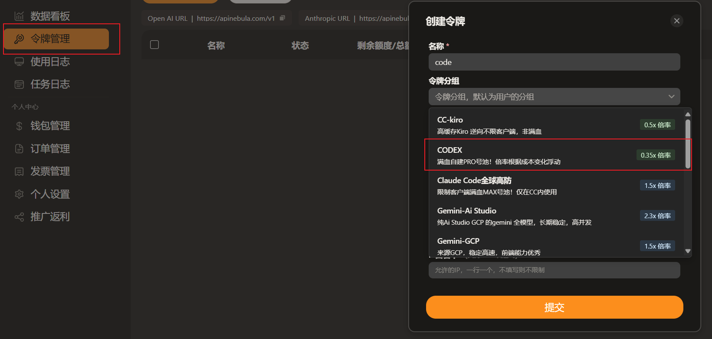

第2步： CC Switch配置

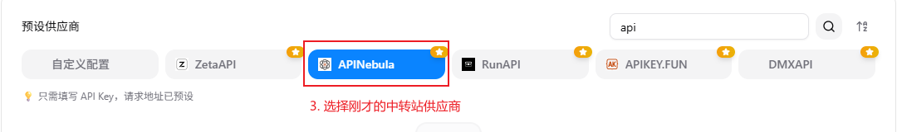

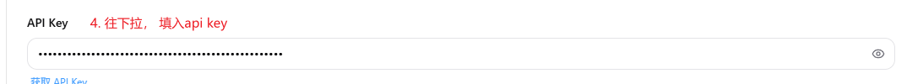

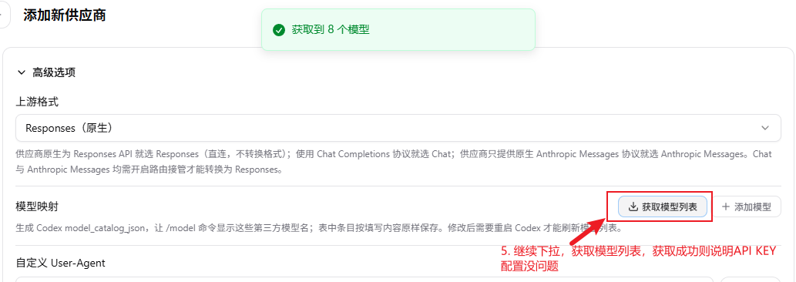

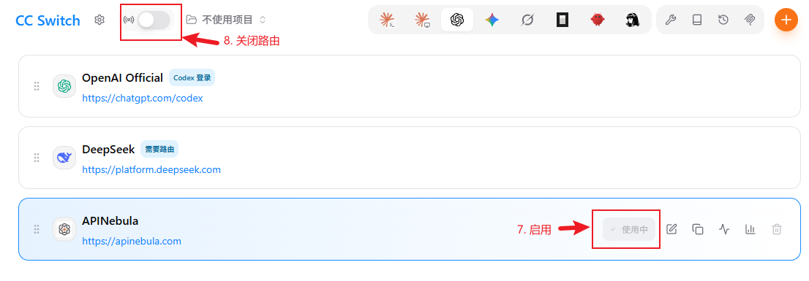

第三步： 重启Codex！！！ 进行测试

经测试，可以正常使用多模态，可以识别图片。

---

---

## 三、好用的工作流

+ https://www.skills.sh/obra/superpowers/brainstorming： 头脑风暴
+ https://www.skills.sh/0x0funky/agent-sprite-forge/generate2dsprite 和 https://www.skills.sh/0x0funky/agent-sprite-forge/generate2dmap： 拆解和设计游戏素材
+ https://www.skills.sh/omer-metin/skills-for-antigravity/game-ui-design 游戏UI设计

